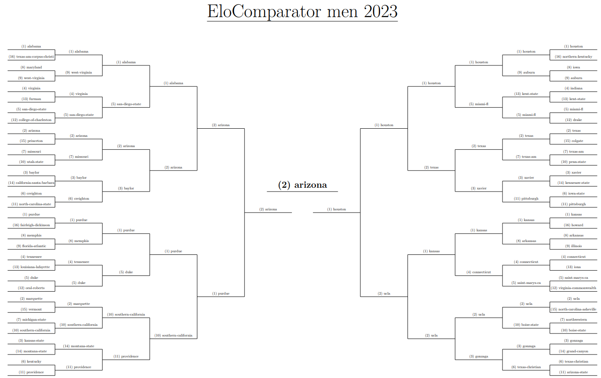

# NCAA Predictions

This project scrapes NCAA Division I college basketball game data, uses various prediction algorithms to compare different teams, and produces a filled-in bracket with table of probabilities.

The current algorithms are:

* Naive Seed (i.e. "chalk")
* [Bradley-Terry](https://en.wikipedia.org/wiki/Bradley%E2%80%93Terry_model)
* [Elo](https://en.wikipedia.org/wiki/Elo_rating_system)
* [PageRank](https://en.wikipedia.org/wiki/PageRank)
* Path Weight
* Resistance

You can read more about each in the corresponding module's docstrings.

This project currently only works on Windows.
You could probably modify some of the commands in `simulator.py` to get it working on other operating systems.

## Prerequisities

* Python 3 and pip
* A LaTeX distribution that has `xelatex`.
I recommend [MiKTeX](https://miktex.org/).

## Usage

1. Install Python dependencies with `pip install -r requirements.txt`
2. Modify the `tournament` variable in `simulator.py` to include whichever arrangement of teams you'd like.
You can find the list of teams in `teams/teams.txt`.
3. Modify the final lines of `simulator.py` to include whichever comparators you'd like.
4. Run with `python simulator.py`.
After running, the result(s) will be .pdf and .tex file(s) in `predictions/`.
The PDF(s) should open for viewing automatically.
